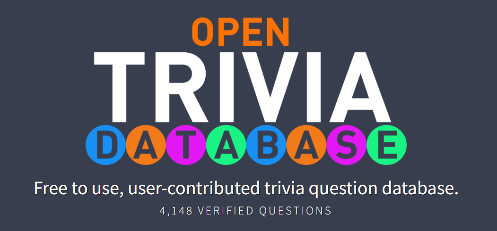

### Application based on Open Trivia Database



# https://opentdb.com/

# QuizzApp API
- [User Authentication](#user-api)
  - [Register](#register)
     - [Register Request](#register-request)
     - [Register Response](#register-response)
  - [Login](#login)
     - [Login Request](#login-request)
     - [Login Response](#login-response)
- [QuizzApp API](#breakfast-api)


## User Authentication

### Register

#### Register Request
```js
POST /auth/register
Content-Type: application/json
```
```json
{
    "firstName": "John",
    "lastName": "Smith",
    "email": "test@test.com",
    "password": "passwd"
}
```
#### Register Response
```js
201 Created
```
```json
{
  "firstName": "John",
  "lastName": "Smith",
  "email": "test@test.com",
  "token": "eyJhbGciOiJ(...)"
}
```

---

### Login

#### Login Request
```js
POST /auth/login
Content-Type: application/json
```
```json
{
    "email": "test@test.com",
    "password": "passwd"
}
```
#### Login Response
```js
200 OK
```
```json
{
  "id": "e14585c9-85ff-4f30-85c0-8d19ced5c18e",
  "firstName": "John",
  "lastName": "Smith",
  "email": "test@test.com",
  "token": "eyJhbGciOiJ(...)"
}
```
---

## Authorization

For endpoints requiring authorization, include the following HTTP header in your requests:
Authorization: Bearer <your-token>

Replace <your-token> with the token received from the Login response.

---

## QuizzApp Api

---

### /api/question

#### POST Request
```json
{
  "category": "string",
  "difficulty": "string",
  "type": "string",
  "questionText": "string",
  "correctAnswer": "string",
  "incorrectAnswers": ["string"]
}
```
#### Response
```json
{
  "status": "OK"
}
```

#### GET Request
```json
{
  "category": "string",
  "difficulty": "string",
  "type": "string",
  "take": "integer"
}
```
#### Response
```json
{
  "questions": [
    {
      "id": "uuid",
      "category": "string",
      "difficulty": "string",
      "questionText": "string",
      "answers": ["string"],
      "type": "string"
    }
  ]
}
```

#### DELETE Request
```json
{
  "status": "OK"
}
```

---

### /api/question/answer

#### POST Request
```json
{
  "questionId": "uuid",
  "answer": "string"
}
```
#### Response
Sample Body for INCORRECT answer:
```json
{
  "value": {
    "isCorrect": false,
    "correctAnswer": "Long Term Support",
    "pointsAwarded": 0
  },
  "formatters": [],
  "contentTypes": [],
  "declaredType": null,
  "statusCode": 200
}
```
Sample Body for CORRECT answer:
```json
{
  "value": {
    "isCorrect": true,
    "correctAnswer": "Long Term Support",
    "pointsAwarded": 1
  },
  "formatters": [],
  "contentTypes": [],
  "declaredType": null,
  "statusCode": 200
}
```
---

### /api/user/points

#### GET Request
sample body response:
```json
{
  "Entertainment: Board Games": 1,
  "Entertainment: Comics": 1,
  "Entertainment: Japanese Anime & Manga": 1,
  "General Knowledge": 1,
  "Science: Computers": 2
}
```

